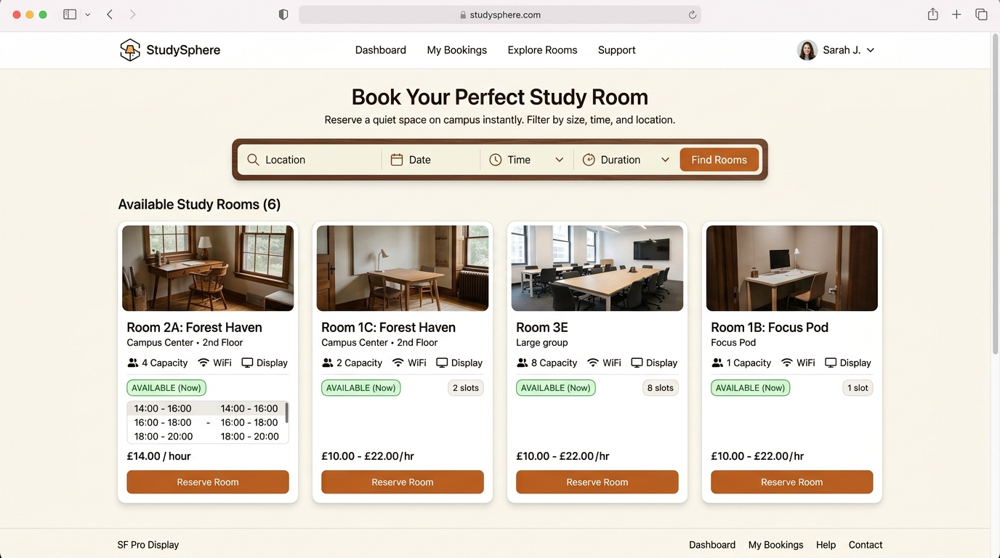
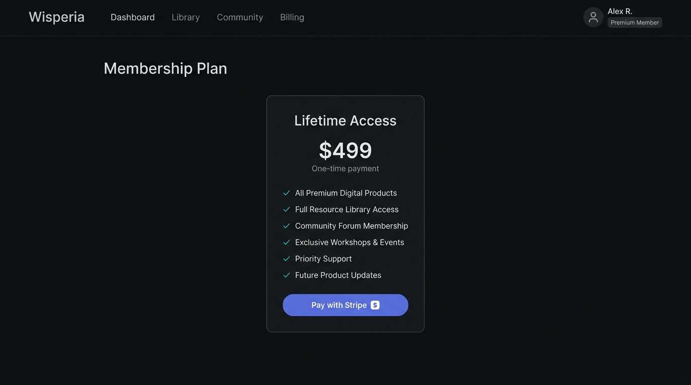
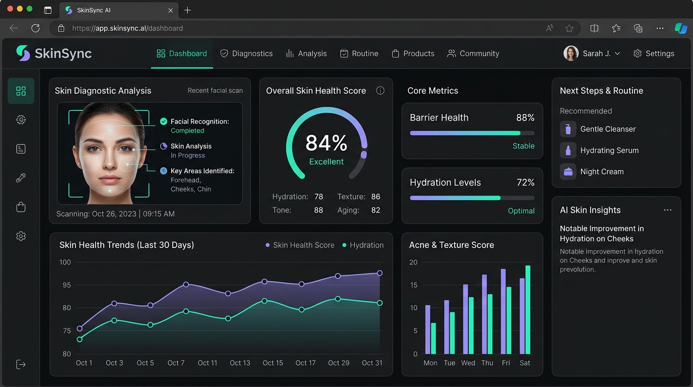
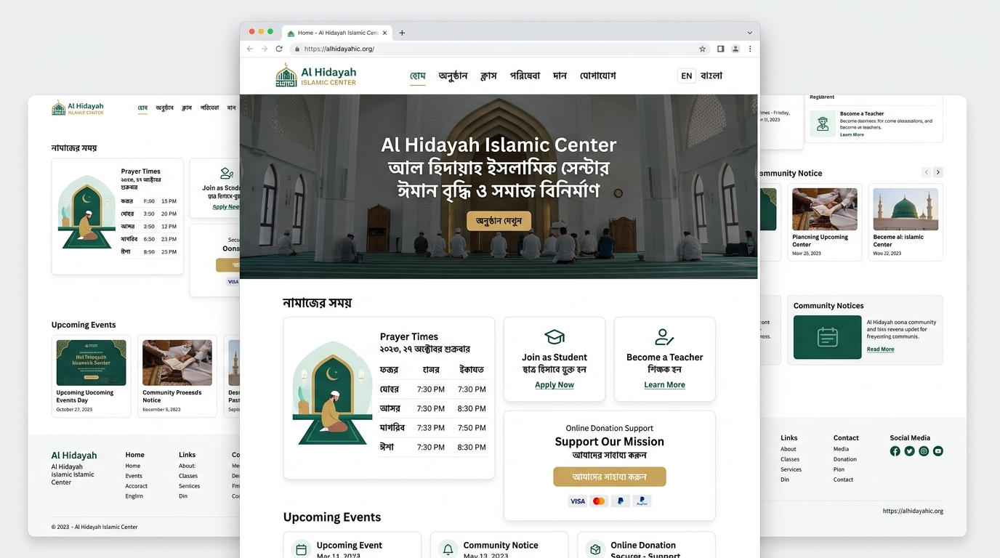

<p align="center">
  
</p>

<div align="center">

# NAJIBA TAKARRUM

**Full-Stack Developer** &nbsp;•&nbsp; React &nbsp;•&nbsp; Next.js &nbsp;•&nbsp; Node.js &nbsp;•&nbsp; MongoDB

*Building thoughtful interfaces and reliable web systems.*

<br/>

[](https://github.com/najiba-ta)
&nbsp;
[](https://linkedin.com/in/najiba-webdev/)
&nbsp;
[](https://najiba-takarrum.vercel.app/)
&nbsp;
[](mailto:shahidnajiba@gmail.com)

</div>

<br/>

---

<br/>

### ┌── terminal.session ──────────────────────────────────────────┐

```text
┌─────────────────────────────────────────────────────────────┐
│ ● ● ● najiba.sh                                             │
│                                                             │
│ $ whoami                                                    │
│ Najiba Takarrum                                             │
│ Full-Stack Developer                                        │
│                                                             │
│ $ cat personality.json                                      │
│ {                                                           │
│   "mode"      : "focused",                                  │
│   "curiosity" : "high",                                     │
│   "noise"     : "low",                                      │
│   "approach"  : "understand → build → refine"               │
│ }                                                           │
│                                                             │
│ $ echo $STATUS                                              │
│ building / learning / shipping                              │
└─────────────────────────────────────────────────────────────┘
```

<br/>

---

<br/>

### / about

I build modern web applications with a strong focus on clean interfaces, thoughtful architecture, and practical user experience.

My engineering mindset is driven by curiosity and discipline: I learn primarily by building real products, breaking systems to understand why they broke, and methodically refining them into simple, maintainable solutions.

<br/>

---

<br/>

### / current-focus

```text
CURRENTLY BUILDING
├── Production-grade Full-Stack web applications
├── Performance-optimized React & Next.js interfaces
├── Secure REST APIs, role-based auth & database architectures
└── AI-assisted developer workflows to ship higher quality software

EXPLORING NEXT
├── Advanced backend engineering & distributed systems
├── Practical AI automation pipelines
└── High-throughput database optimization
```

<br/>

---

<br/>

### / tech-stack

<table width="100%">
  <thead>
    <tr>
      <th align="left" width="33%">Frontend</th>
      <th align="left" width="33%">Backend & Database</th>
      <th align="left" width="34%">Tools & Ecosystem</th>
    </tr>
  </thead>
  <tbody>
    <tr>
      <td valign="top">
        <p>
           &nbsp; HTML5<br/>
           &nbsp; CSS3<br/>
           &nbsp; JavaScript (ES6+)<br/>
           &nbsp; React.js<br/>
           &nbsp; Next.js<br/>
           &nbsp; Tailwind CSS
        </p>
      </td>
      <td valign="top">
        <p>
           &nbsp; Node.js<br/>
           &nbsp; Express.js<br/>
           &nbsp; MongoDB<br/>
           &nbsp; RESTful APIs<br/>
           &nbsp; Firebase
        </p>
      </td>
      <td valign="top">
        <p>
           &nbsp; Git<br/>
           &nbsp; GitHub<br/>
           &nbsp; VS Code<br/>
           &nbsp; Postman<br/>
           &nbsp; Vercel<br/>
           &nbsp; Figma
        </p>
      </td>
    </tr>
  </tbody>
</table>

<br/>

---

<br/>

### / featured-projects

<br/>

<!-- PROJECT 01: StudySphere -->
<table width="100%">
  <tr>
    <td width="55%" align="center" valign="middle">
      <a href="https://studsphere-pi.vercel.app/" target="_blank">
        
      </a>
    </td>
    <td width="45%" valign="middle" style="padding-left: 20px;">
      <h3>01 &nbsp; StudySphere</h3>
      <p><strong>Library & Study Room Booking Platform</strong></p>
      <p>A full-stack reservation engine engineered to eliminate double-booking race conditions through real-time slot verification, role-aware access controls, and synchronized availability calendars.</p>
      <p><code>Next.js</code> • <code>React</code> • <code>MongoDB</code> • <code>Better Auth</code> • <code>JWT</code> • <code>Tailwind</code></p>
      <p>
        <a href="https://studsphere-pi.vercel.app/" target="_blank"><strong>↗ Live Demo</strong></a>
        &nbsp;&nbsp;|&nbsp;&nbsp;
        <a href="https://github.com/najiba-ta/StudySphere" target="_blank"><strong>↗ Source Code</strong></a>
      </p>
    </td>
  </tr>
</table>

<br/>

<!-- PROJECT 02: Wisperia -->
<table width="100%">
  <tr>
    <td width="45%" valign="middle" style="padding-right: 20px;">
      <h3>02 &nbsp; Wisperia</h3>
      <p><strong>Product Platform with Lifetime Access Model</strong></p>
      <p>A modern web application featuring an understated, premium design language, secure Stripe webhook checkout pipelines, and lifetime digital asset access management.</p>
      <p><code>React</code> • <code>Next.js</code> • <code>Node.js</code> • <code>MongoDB</code> • <code>Stripe</code></p>
      <p>
        <a href="https://github.com/najiba-ta/Wisperia" target="_blank"><strong>↗ Source Code</strong></a>
      </p>
    </td>
    <td width="55%" align="center" valign="middle">
      <a href="https://github.com/najiba-ta/Wisperia" target="_blank">
        
      </a>
    </td>
  </tr>
</table>

<br/>

<!-- PROJECT 03: SkinSync -->
<table width="100%">
  <tr>
    <td width="55%" align="center" valign="middle">
      <a href="https://github.com/najiba-ta" target="_blank">
        
      </a>
    </td>
    <td width="45%" valign="middle" style="padding-left: 20px;">
      <h3>03 &nbsp; SkinSync</h3>
      <p><strong>AI Skincare Diagnostics & Scoring Concept</strong></p>
      <p>An intelligent web experience exploring client-side image intake workflows, real-time diagnostic telemetry, and structured skin health analytics visualizations.</p>
      <p><code>React</code> • <code>Node.js</code> • <code>REST API</code> • <code>Tailwind CSS</code></p>
      <p>
        <a href="https://github.com/najiba-ta" target="_blank"><strong>↗ Source Code</strong></a>
      </p>
    </td>
  </tr>
</table>

<br/>

<!-- PROJECT 04: Al Hidayah Islamic Center -->
<table width="100%">
  <tr>
    <td width="45%" valign="middle" style="padding-right: 20px;">
      <h3>04 &nbsp; Al Hidayah Islamic Center</h3>
      <p><strong>Community Management & Institutional Portal</strong></p>
      <p>A production portal engineered for member registration, dual-role access control (students / teachers), admin verification workflows, bilingual support, and Stripe donations.</p>
      <p><code>Next.js</code> • <code>Node.js</code> • <code>Express</code> • <code>MongoDB</code> • <code>Stripe</code></p>
      <p>
        <a href="https://najiba-takarrum.vercel.app/" target="_blank"><strong>↗ Project Overview</strong></a>
        &nbsp;&nbsp;|&nbsp;&nbsp;
        <a href="https://github.com/najiba-ta" target="_blank"><strong>↗ Repository</strong></a>
      </p>
    </td>
    <td width="55%" align="center" valign="middle">
      <a href="https://najiba-takarrum.vercel.app/" target="_blank">
        
      </a>
    </td>
  </tr>
</table>

<br/>

---

<br/>

### / engineering-principles

```text
01  Understand before building.
02  Keep complexity where it belongs.
03  Good UI is part of good engineering.
04  Build → test → refine.
```

<br/>

---

<br/>

### / telemetry & activity

<p align="center">
  
  
</p>

<p align="center">
  
</p>

<p align="center">
  <picture>
    <source media="(prefers-color-scheme: dark)" srcset="https://github.com/najiba-ta/najiba-ta/raw/output/snake-dark.svg">
    <source media="(prefers-color-scheme: light)" srcset="https://github.com/najiba-ta/najiba-ta/raw/output/snake.svg">
    
  </picture>
</p>

<br/>

---

<br/>

### / git-status

```text
$ git status
On branch main
Changes:
  + improving backend architecture
  + building real-world products
  + exploring AI workflows
  + refining UI systems

nothing to commit.
still building.
```

<br/>

---

<br/>

### / contact

<div align="center">

*Let's build something meaningful.*

<br/>

[](https://github.com/najiba-ta)
&nbsp;
[](https://linkedin.com/in/najiba-webdev/)
&nbsp;
[](https://najiba-takarrum.vercel.app/)
&nbsp;
[](mailto:shahidnajiba@gmail.com)

<br/><br/>

<sub>built with curiosity • refined with patience &nbsp;|&nbsp; © Najiba Takarrum</sub>

<br/>


</div>
